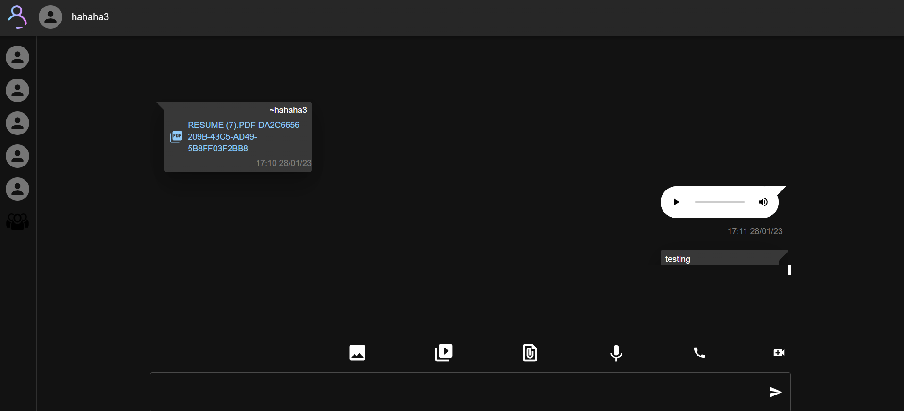
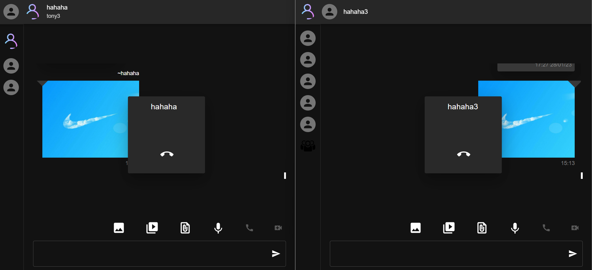
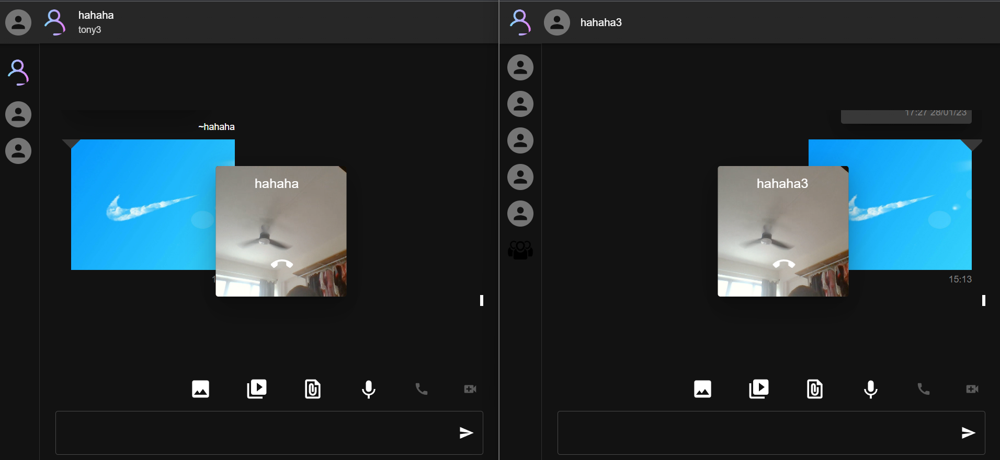

# React Chat

- Packages
  - Websocket (Signaling Server) between browsers
  - protobufJs (message data)
    - Pros
      - smaller than JSON format thus transmit faster
    - Cons
      - required schema
      - Not as readable as JSON
  - Simple Peer (WebRTC library for audio call and video call)
  - Material UI (css library)
  - Redux (state management & middleware to handle Websocket connection and
    WebRTC connection)
  - react-router-dom
  - firebase (CI/CD deployment)

## Features

    - Chat Message (Private and Group)
    - Create Group and Join Group
    - Send Media Messages (Audio , Images , Video , Files)
    - Audio Call (Private only)
    - Video Call (Private only)

## Screenshot

Chat Message

Audio Call

Video Call

